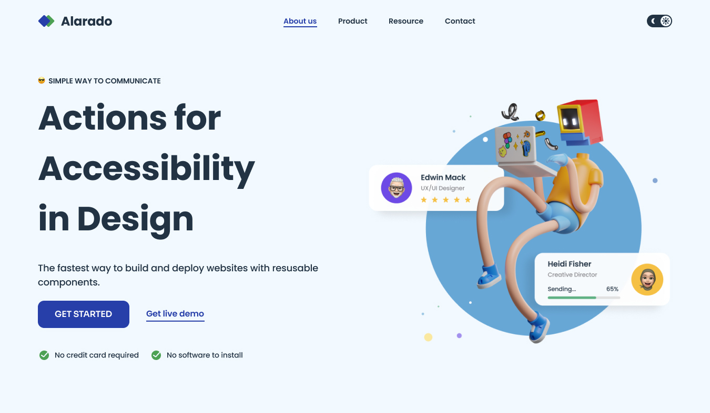
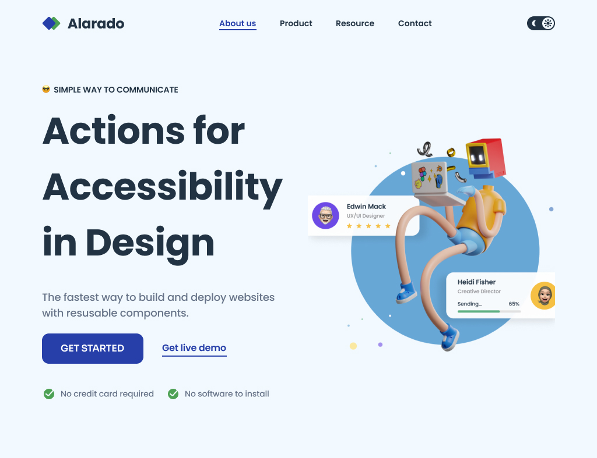
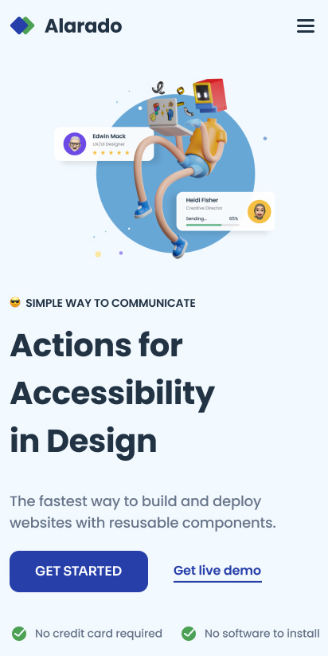

<h1 align="center">Simple Homepage - Alarado | devChallenges</h1>

<div align="center">
   Solution for <a href="https://devchallenges.io/challenge/simple-hompage-alarado" target="_blank">Simple Homepage - Alarado</a> from <a href="https://devchallenges.io" target="_blank">devChallenges.io</a>.
</div>


---


## Overview

Simple Homepage - Alarado is a pixel-perfect, fully responsive landing page built as a solution to the devChallenges.io challenge. The project focuses on clean, accessible HTML and modern CSS, closely following the provided design for desktop, tablet, and mobile breakpoints. No frameworks or build tools were used—just semantic HTML and custom CSS.


## Screenshots

| Desktop | Tablet | Mobile |
| ------- | ------ | ------ |
|  |  |  |

## Getting Started

To view or use this project locally:

1. Clone the repository:
   ```sh
   git clone https://github.com/Ayokanmi-Adejola/simple-homepage-alarado.git
   ```
2. Open `index.html` in your browser. No build step required.

## Features

- Responsive navigation bar with active state
- Hero section with headline, description, and call-to-action buttons
- Feature highlights with icons
- Fully responsive layout for desktop, tablet, and mobile
- Clean, accessible, and modern design

## Built With

- Semantic HTML5 markup
- CSS custom properties
- Flexbox
- Responsive design

## Performance & Accessibility

- Lighthouse score: 100/100 (Performance, Accessibility, Best Practices, SEO)
- Semantic HTML and proper alt text for images
- Keyboard navigable and accessible color contrast


## What I Learned

- Improved my skills in semantic HTML and modern CSS layout (Flexbox, Grid)
- Practiced building a fully responsive layout from a static design
- Paid close attention to design details such as spacing, color, and typography
- Enhanced my ability to structure HTML for accessibility and maintainability

## Useful Resources

- [MDN Web Docs](https://developer.mozilla.org/) — HTML and CSS reference
- [CSS Tricks Flexbox Guide](https://css-tricks.com/snippets/css/a-guide-to-flexbox/) — Layout help
- [devChallenges.io Community](https://devchallenges.io/) — Challenge details and support


---

## 👤 Author
Coded by **Ayokanmi Adejola**  
Challenge by [devChallenges.io](https://devchallenges.io/)